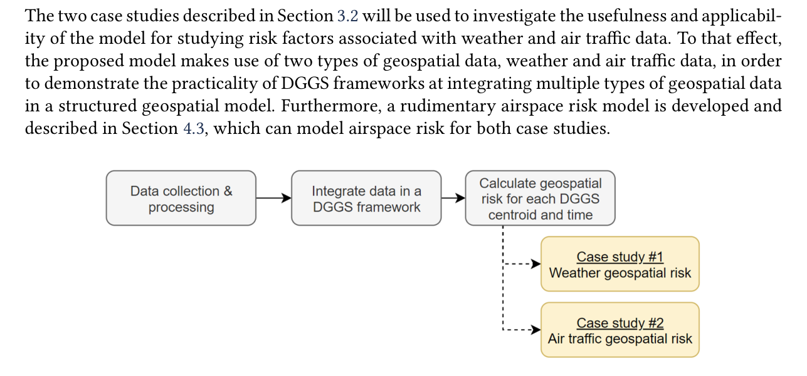

# Geospatial Airspace Risk Model

Reference implementation accompanying the research methodology presented in:

**N. Vincent-Boulay and C. Marsden, "A Geospatial Approach to Modeling Airspace Risk Factors," _Journal of Open Aviation Science_, vol. 3, no. 1, 2025.**  
DOI: https://doi.org/10.59490/joas.2025.7402

## Overview

This repository provides a compact, reproducible implementation of the paper's core methodology for representing a three-dimensional airspace region with a regular DGGS-style grid and evaluating location-based weather and mid-air-collision risk at grid centroids over time.

The published study integrates ADS-B aircraft observations from the OpenSky Network and weather-radar information from NOAA. Those source datasets are not redistributed here. Instead, a deterministic synthetic example is included so the computational concepts can be exercised without external services or large research datasets.

<p align="center">
  
</p>

<p align="center"><em>Figure 1. Main components of the geospatial airspace model. Reproduced from Vincent-Boulay and Marsden (2025), <a href="https://doi.org/10.59490/joas.2025.7402">A Geospatial Approach to Modeling Airspace Risk Factors</a>, licensed under <a href="https://creativecommons.org/licenses/by/4.0/">CC BY 4.0</a>.</em></p>

## What this repository demonstrates

- construction of a regular three-dimensional airspace grid;
- deterministic 3D Morton indexing for grid cells;
- centroid-based convergence-time calculations;
- location-based mid-air-collision risk using converging aircraft pairs;
- location-based weather risk using moving storm cells;
- conversion of time-based risk metrics to bounded event-risk scores;
- fusion of weather and air-traffic risk;
- a self-contained synthetic demonstration and regression tests.

## Repository structure

```text
.
├── README.md
├── CITATION.cff
├── requirements.txt
├── .gitignore
├── src/
│   └── geospatial_airspace_risk/
│       ├── __init__.py
│       ├── grid.py
│       └── risk.py
├── examples/
│   └── run_synthetic_demo.py
├── tests/
│   ├── test_grid.py
│   └── test_risk.py
└── docs/
    ├── figures/
    │   └── geospatial_airspace_model_methodology.png
    ├── REPRODUCIBILITY.md
    └── RESEARCH_CODE_PROVENANCE.md
```

## Quick start

Create and activate a Python environment, then install the dependencies:

```bash
pip install -e ".[dev]"
```

Run the synthetic demonstration from the repository root:

```bash
python -m examples.run_synthetic_demo
```

Run the regression tests:

```bash
pytest -q
```

## Relationship to the published study

This repository is a **reference implementation** of the core methodology presented in the paper. The original research code subsequently evolved as part of a larger PhD airspace modeling project.

See `docs/RESEARCH_CODE_PROVENANCE.md` for the provenance boundary and `docs/REPRODUCIBILITY.md` for the distinction between the synthetic demonstration and reproduction of the full paper case study.

## Data

The paper used publicly available ADS-B and NOAA weather-radar sources, but the processed study datasets are not bundled in this repository. Users wishing to reproduce the complete paper case study should obtain the source data from the original providers and follow the methodology and parameter definitions in the publication.

## Scope and limitations

The risk quantities implemented here are research metrics for analyzing spatially distributed airspace risk factors. They are not certified operational safety probabilities, separation minima, or collision-avoidance logic.

## Citation

If this repository or methodology is useful in your work, please cite the paper above. A machine-readable citation is provided in `CITATION.cff`.

## Author

**Nicolas Vincent-Boulay**  
Aerospace engineering PhD candidate and machine-learning researcher
